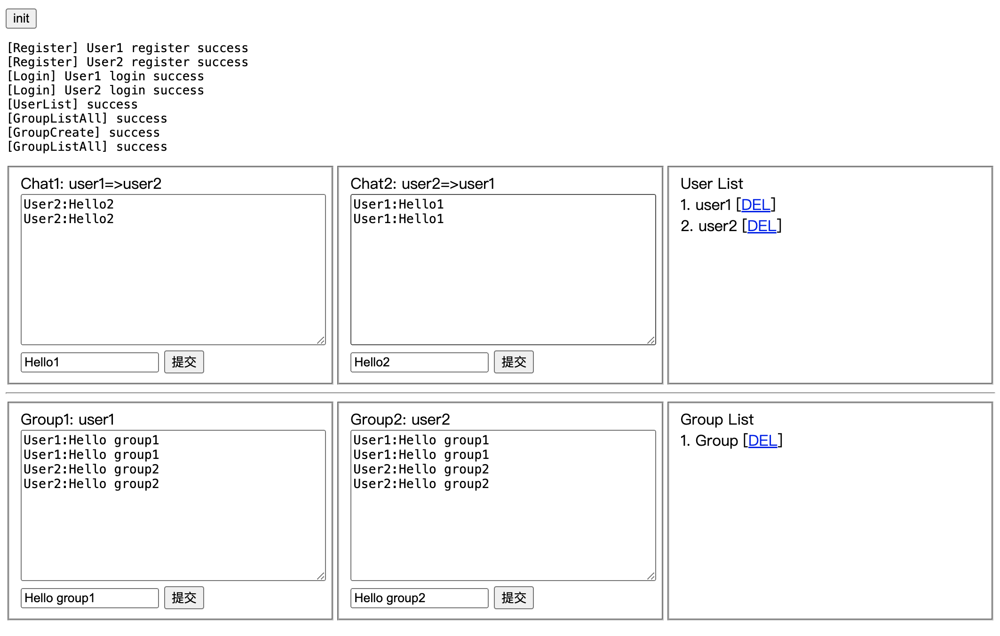

# Chatroom

chatroom services or embeded chatroom

## screenshot



## api docs

https://doc.apipost.net/docs/34ab26f038e5000

## service mode
```shell
$ go run .
- or -
$ docker run --rm -it -p 8080:8080 -v /tmp/db/:/db/ ohko/chatroom
```

## embeded mode
```golang
import "github.com/ohko/chatroom/srv"

if err := com.Init("./db/chatroom.db"); err != nil {
	log.Println(err)
}
go srv.PingDeamon()
srv.HandleWS()
srv.HandleApiFuncs()
```